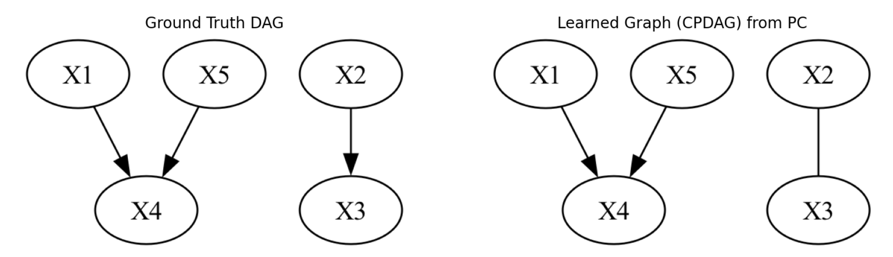

# DSC180A Project — Causal Discovery in Financial Systems via Domain-Specialized PCMCI

This project builds on the *Causal Copilot* framework to explore how causal discovery methods behave in both controlled synthetic settings and real-world financial time-series data.

**Project Website:**
https://lauradiazrodriguez.github.io/dsc180_group1/

Our work evolves across two stages:

---

# Quarter 1 — Simulation & Baseline Causal Discovery

We first developed a controlled environment for causal discovery using synthetic data. This allowed us to test how algorithms behave when the true causal structure is known.

### Key components

**1. Synthetic Data Simulation**  
We generate datasets using structural equation models (SEMs) with configurable:
- Graph structures  
- Noise distributions  
- Functional forms (linear/nonlinear)  
- Sample sizes and densities  

This enables controlled experimentation on causal discovery performance.

**2. Causal Discovery via the PC Algorithm**  
We applied the constraint-based PC algorithm to recover causal graphs from simulated data, evaluating performance using:
- Conditional independence testing  
- Graph recovery and orientation rules  
- Structural Hamming Distance (SHD)  
- Visualization of learned graphs  

This stage established a baseline for how causal discovery works in idealized settings.

---

# Quarter 2 — Financial Domain Specialization with PCMCI

In Quarter 2, we moved from synthetic experiments to **real-world financial time-series data**, where causal discovery is far more challenging and impactful.

We focus on **PCMCI (Peter–Clark Momentary Conditional Independence)**, a time-series extension of PC designed for temporal data.

### Goals

- Specialize causal discovery for the financial domain  
- Tune PCMCI hyperparameters for improved performance  
- Compare discovered relationships to domain knowledge  
- Test robustness of discovered relationships over time  

---

## Financial Domain Analysis

Implemented in:

```bash
Financial_Domain_Specialization.ipynb
```

### What this notebook does

**1. Real Financial Data Integration**
- Macroeconomic indicators (e.g., interest rates, exchange rates)
- Market variables
- Multi-source financial datasets

**2. PCMCI Hyperparameter Tuning**
We systematically explore:
- Maximum time lag  
- Significance thresholds  
- Independence test configurations  

to identify settings that produce meaningful financial relationships.

**3. Knowledge Graph Comparison**
We compare PCMCI-discovered relationships against a domain-knowledge-based graph to evaluate plausibility.

**4. Robustness Testing**
We test whether discovered relationships remain useful when predicting on data from different time segments, evaluating temporal stability.

---

# Main Notebooks

- `generating_simulated_data.ipynb` — synthetic data generation  
- `PC_alg.ipynb` — baseline PC algorithm experiments  
- `Financial_Domain_Specialization.ipynb` — financial PCMCI analysis  

---

# Running the Project Using Docker

To ensure reproducibility, we provide a minimal Docker environment that supports the dependencies required for:

- `generating_simulated_data.ipynb`
- `PC_alg.ipynb`
- `Financial_Domain_Specialization.ipynb`

---

## 1. Build the Docker Image

From the repository root:

```bash
docker build -t causal-copilot-notebooks .
```

---

## 2. Run a Container With the Project Mounted

```bash
docker run --rm -it \
  -v "$(pwd):/workspace" \
  -p 8888:8888 \
  causal-copilot-notebooks
```

Then inside the container:

```bash
jupyter lab --ip=0.0.0.0 --no-browser --NotebookApp.token=''
```

Open:

```
http://localhost:8888
```

---

## 3. Running the Notebooks

Open and execute:

```
- generating_simulated_data.ipynb
- PC_alg.ipynb
- Financial_Domain_Specialization.ipynb
```

The simulation notebook will automatically create timestamped output folders under:

```bash
simulated_data/
```

The PC algorithm notebook will:

- Load simulated data
- Run the PC algorithm
- Visualize the inferred CPDAG
- Compute Structural Hamming Distance (SHD)
- Compare inferred graphs against the true simulated structure




The PCMCI fine-tuned analysis notebook contains the primary Quarter 2 contribution: domain-specialized causal discovery on financial time-series data.

It will:

- Integrate real financial and macroeconomic datasets  
- Apply the PCMCI algorithm for time-series causal discovery  
- Tune hyperparameters such as lag depth and significance thresholds  
- Compare discovered relationships to domain-knowledge graphs  
- Evaluate robustness by testing predictive performance across different time segments  

This notebook demonstrates how causal discovery can be adapted for real-world domains where ground truth is unknown and temporal dynamics matter.
---

## 4. Exiting the Container

To exit the running container:

```bash
exit
```

---

# Additional Notes

- This repository currently includes only the dependencies required for Quarter 1 deliverables.
- Full LaTeX, GPU, and advanced Causal Copilot tooling will be added in future project phases.

---

## Dependencies & Versions Installed in the Docker Image

The environment is built on:

### Base image
- `python:3.12-slim`

---

### System packages
- `graphviz` (required for causal graph visualization)
- `build-essential` (needed to compile scientific Python packages on ARM/aarch64 systems)

---

### Python libraries (as pinned in `requirements_notebooks.txt`)

#### Core scientific stack
- `numpy==1.26.4`
- `pandas==1.5.3`
- `scipy==1.13.1`
- `scikit-learn==1.5.2`
- `statsmodels` (ADF tests & time-series utilities)

---

#### Visualization
- `matplotlib==3.9.2`
- `seaborn` (used in financial analysis notebook)

---

#### Graph & causal discovery
- `causal-learn` (PC algorithm)
- `tigramite` (PCMCI causal discovery)
- `networkx==3.2.1`
- `python-igraph==0.11.8`
- `texttable==1.7.0` (igraph dependency)
- `graphviz`
- `pydot==3.0.2` (GraphViz wrapper)

---

#### Financial data sources
- `yfinance` (market data)
- `fredapi` (FRED macroeconomic data)
- `alpha_vantage` (FX and financial indicators)

---

#### Notebook environment
- `jupyterlab`
- `ipykernel`
- `tqdm`

---

These packages are sufficient to run:

- Synthetic data generation  
- PC algorithm experiments  
- Financial-domain PCMCI specialization and robustness testing  

No additional local setup is required beyond Docker.

---

## Acknowledgments

Portions of the data simulation pipeline used in this project are adapted from the open-source implementation provided by the **Causal Copilot** research team.

We acknowledge and thank the authors of the following work:

**Causal-Copilot: Autonomous Causal Analysis Agent**  
*Xinyue Wang, Kun Zhou, Wenyi Wu, Har Simrat Singh, Fang Nan, Songyao Jin, Aryan Philip, Saloni Patnaik, Hou Zhu, Shivam Singh, Parjanya Prashant, Qian Shen, Biwei Huang*  
(2024)

Their publicly released codebase supplied the foundations for our synthetic data generation module, including configurable structural equation models, graph sampling utilities, and noise distribution functions.  
Our project extends these components for course-specific experimentation and analysis.

We gratefully recognize their contributions to open causal inference research.
